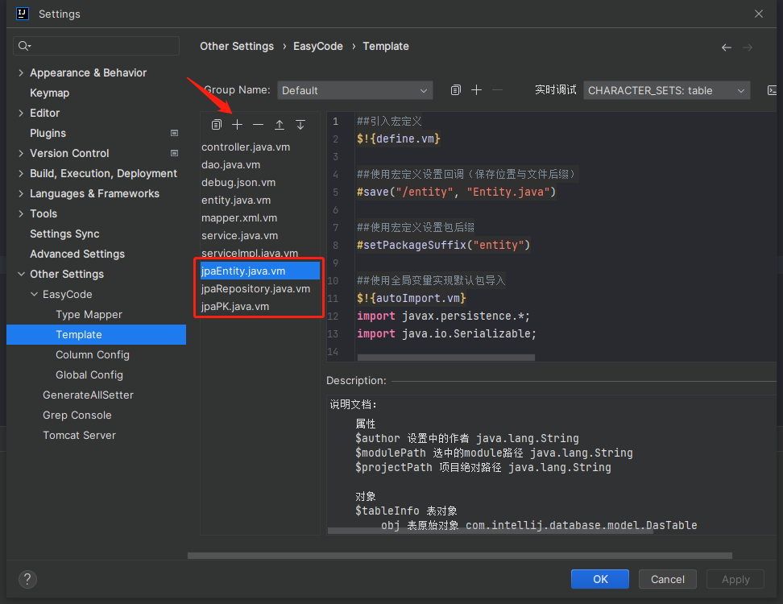

# EasyCode模板 自动生成JPA实体类、主键类、仓库类。Template for automatically generating JPA entity, primeKey, and repository class

### 

### Requirement

- ##### IDE：
  
  - IntelliJ IDEA Ultimate
    
    (Community Edition with Database Tool Plugin may also work. I didn't test it 'cause it's a paid plugin)

- ##### Plugin：
  
  - Database tools and SQL
  
  - Easy Code

### Q&A:

##### 问：为什么不用中文写文档？

答：我懒得写双语。欢迎好心人翻译后提个PR噢~

##### Q: Column Type dosen't match with Java Type.

A: Open IDEA Settings - Other Settings - EasyCode - Type Mapper to change it manually.

##### Q: Lack of some imports.

A: Manually imports them, if only a few files have this issue. Or edit the template file to import them for ALL files generate by this template.

##### Q: Why there's so many getters, setters, constructors?

A: 'Cause some programers may not have Lombok plugin installed. (It's 2023! Pls Install it!)

### How to use

1. Add templates to your "EasyCode" plugin:
   
   - Open IDEA Settings - Other Settings - EasyCode - Template
   
   - Click the add button on the top
   
   - Copy the template code from this repository and paste them in the template editor
     
     

2. Connect to your database through "Database tools and SQL" plugins

3. Right click the tables you want to generate JPA entities, primeKeys, repositorys. Choose "EasyCode" -> "Generate Code"
   
   

4. In the popup window, click the "Choose" button on the right side of "Package"
   
   

5. Choose the parent directory of the 'entity' & 'repository'
   
   

6. Select the files you'd like to generate using EasyCode templates
   
   

7. Done. You'll find these files in the package you chose in step5
